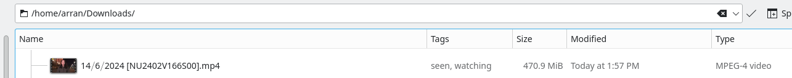
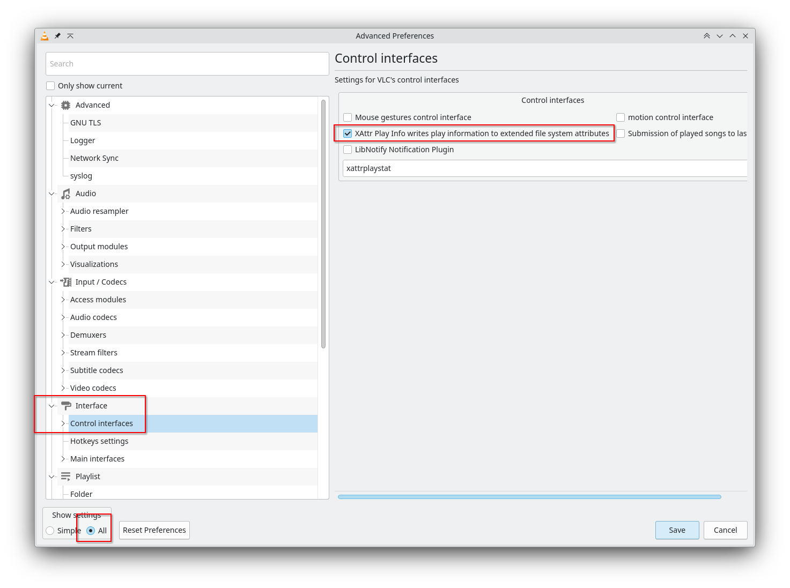

# vlc xattr plugin

This is a plugin for VLC which adds the xattr tag 'seen' to the `user.xdg.tags` list anytime you watch a video.

```bash
% attr -g xdg.tags ~/Downloads/14⧸6⧸2024\ \[NU2402V166S00\].mp4
Attribute "xdg.tags" had a 4 byte value for /home/arran/Downloads/14⧸6⧸2024 [NU2402V166S00].mp4:
seen
```



Currently for any system that supports `setxattr` and `getxattr` which AFAIK is just Linux, but Mac might, and Windows might via WSL. (It should be possible to port it.)

# Compatibility and platform support

* **Tested VLC builds:** VLC 3.0.20 and 3.0.21 from distro packages on Linux.
* **VLC APIs used:** interface module hooks (`set_capability("interface", 1)`), playlist callbacks (`input-current`, `intf-event`), and metadata helpers (`input_item_GetTitleFbName`, `input_item_GetURI`). The plugin needs headers from `vlc-plugin-dev`/`vlc-devel` packages that ship these interfaces.
* **Filesystem APIs:** requires POSIX extended attributes (`listxattr`, `getxattr`, `setxattr`) and the `user.xdg.tags` namespace. Files must live on a filesystem that enables user xattrs (e.g., ext4/xfs with the `user_xattr` mount option).
* **Platform notes:**
  * Linux: supported and verified with the above VLC versions.
  * WSL: the plugin only works when the media resides on a filesystem that exposes `user.*` xattrs (the default NTFS mounts in WSL do not). Use WSL2 virtual ext4 disks or other xattr-capable mounts.
  * macOS: not yet tested. macOS supports extended attributes but typically uses the `com.apple.*` namespace, so behavior may vary; use VLC 3.x headers and verify `user.xdg.tags` is writable.

# How to build it? 

Requirements:
* VLC headers
* Standard C Development Libraries for Linux
* CMake

## Configure (out of tree)

Use an out-of-tree build directory so generated files do not clutter the source tree:

```
cmake -S . -B build -DCMAKE_BUILD_TYPE=Release
```

You can override the plugin install location during configuration with:

```
cmake -S . -B build -DVLC_PLUGIN_INSTALL_DIR=/your/custom/path
```

## Build

Compile the plugin using the configured build directory:

```
cmake --build build
```

## Install

Install the compiled plugin to the chosen prefix (defaults to `/usr/local`):

```
sudo cmake --install build
```

For packaging or staging installs, use `DESTDIR` to stage into a temporary root:

```
DESTDIR=/tmp/vlc-xattr-staging cmake --install build
sudo DESTDIR=/tmp/pkg-root cmake --install build
```

The install step places `libxattrplaying_plugin.so` into `${VLC_PLUGIN_INSTALL_DIR}` (which defaults to `${CMAKE_INSTALL_LIBDIR}/vlc/plugins/misc`).

### Common package install paths

Distribution packaging may set different `libdir` defaults. Typical plugin destinations are:

* Debian / Ubuntu: `/usr/lib/x86_64-linux-gnu/vlc/plugins/misc`
* Fedora / RHEL / CentOS: `/usr/lib64/vlc/plugins/misc`
* Arch Linux: `/usr/lib/vlc/plugins/misc`

You can verify the active plugin path with `pkg-config --variable=pluginsdir vlc` or override it via `-DVLC_PLUGIN_INSTALL_DIR` when configuring CMake.

### Plugin directory notes

VLC looks for interface plugins under the `vlc/plugins/misc` subtree of its plugin search path. When installing without packaging:

* System-wide installs typically land in `/usr/lib*/vlc/plugins/misc` based on your architecture (`lib` vs `lib64`).
* User-local installs (e.g., `cmake --install` with `CMAKE_INSTALL_PREFIX=$HOME/.local`) will place the plugin in `${HOME}/.local/lib/vlc/plugins/misc`, which VLC discovers automatically when run from the same prefix.
* If you pass a custom `-DVLC_PLUGIN_INSTALL_DIR`, ensure the final segment remains `vlc/plugins/misc` so VLC's plugin loader picks it up.

### Gentoo

You can install this plugin from the `arrans_overlay`.

1. Add the overlay:
    ```bash
    eselect repository add arrans_overlay git https://github.com/arran4/arrans_overlay.git
    emaint sync -r arrans_overlay
    ```

2. Install the package:
    ```bash
    emerge media-video/vlc-xattrplaying_plugin
    ```

# How to use it

You will need to enable it in the settings once you have placed it in the correct directory:



# Extended attribute requirements

The tag is stored in the `user.xdg.tags` extended attribute. The filesystem that holds your media must allow writable user xattrs:

* For Linux filesystems such as ext4 or xfs, ensure the mount has `user_xattr` enabled (most distributions do by default).
* NTFS (including the default WSL mounts) and FAT/FAT32/exFAT generally do **not** expose the `user.*` namespace, so setting `user.xdg.tags` will fail.
* Read-only mounts (e.g., optical media, read-only bind mounts, or mounts with `ro`) cannot accept new attributes.

## Verifying xattr support

You can test the capability on a sample file before using the plugin:

```bash
# Attempt to write a temporary tag
setfattr -n user.xdg.tags -v "seen" /path/to/video.mp4

# Read it back
getfattr -n user.xdg.tags /path/to/video.mp4
```

If the first command fails with `Operation not supported` or `Read-only file system`, the filesystem or mount options do not allow writing `user.*` attributes. Move the media to a filesystem that supports user xattrs or remount with the appropriate options.
## Module options

The plugin exposes a few options under *Tools → Preferences → Interface → Control interfaces*:

* **Enable tagging** (`xattr-tagging-enabled`, default: on): master switch to write `user.xdg.tags`.
* **Tag name** (`xattr-tag-name`, default: `seen`): value appended to `user.xdg.tags`.
* **Skip paths** (`xattr-skip-paths`): comma or newline separated list of absolute path prefixes to skip (e.g., `/tmp,/mnt/ramdisk`).

Set the options via the GUI or by adding the following lines to your `vlcrc`:

```
lua-intf=xattrplaying_plugin
xattr-tagging-enabled=1
xattr-tag-name=seen
xattr-skip-paths=/tmp,/mnt/ramdisk
```
